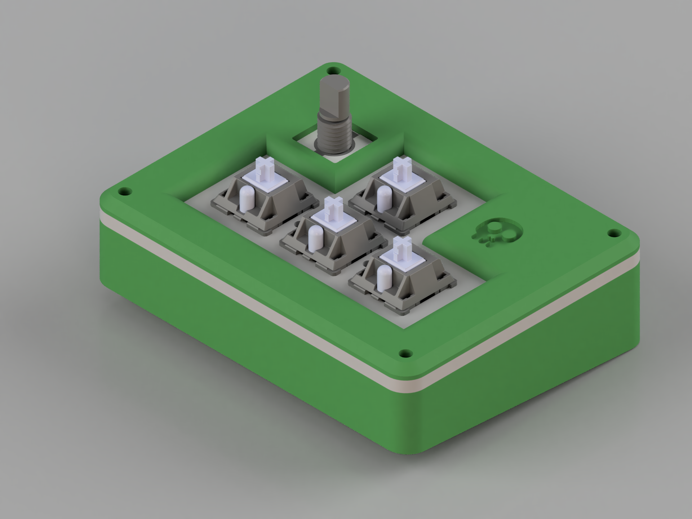
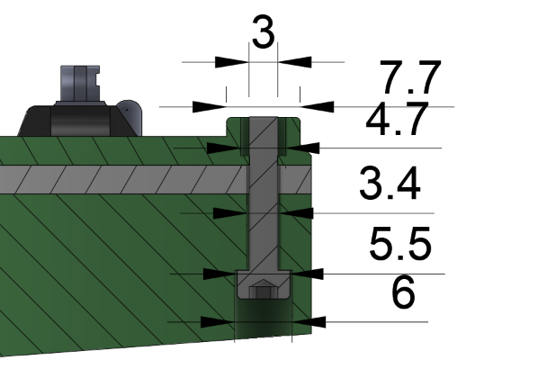
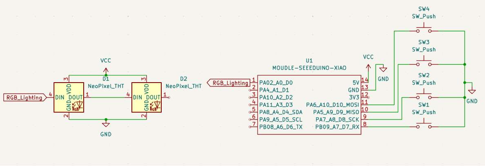
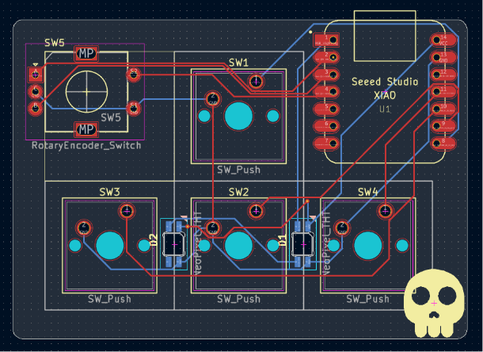

# GD Hackpad

This is my Hackpad designed for the purpose to play Geometry Dash Platformer levels. Basically a DIY Sayo Device but cool yk. 
I chose this project as I am comfortable with Fusion 360, and a chance to learn a new program - Kicad.

## Features:
- Cool 3d printed case
- 2 WS2812B RGB LEDs. Kinda under the keys. I just didn't want it to be too basic. Can also tell me whether its powered on.
- 4 arrow keys to play games
- Rotary encoder

## CAD Model:
Everything fits together using 4 M3 Bolts and heatset inserts. 4 for the case.

It has 3 separate printed pieces. The base which has a tilt, the plate to hold the PCB, and the top shell.

Made in Fusion360.

I added these elevated holes because the shell was 3mm tall, which is shorter than the depth needed for the heatset inserts. Still looks visually fine I reckon.

This also shows how it is assembled. The top plate and angled base sandwhich the plate the holds the switches.

## PCB
Here's my PCB!💀 It was made in KiCad. I added the silkscreen image by using the build in image converter.
I got a skull emoji off google, and placed it on my front silkscreen layer.

Schematic

Layout

PCB

## Firmware Overview
This hackpad uses KMK firmware for everything.

I might change the lights to change colour in the future.

## File structure

There's 4 main folders: CAD, Firmware, PCB, and Production. The CAD folder contains the .step file for the case as a whole. It also contains the 3mf of the same thing, and the fusion f3z. The PCB folder contains .kicad_pcb, .kicad_pro, and .kicad_sch. The Firmware folder contains files for KMK firmware. The production folder has files for 3D printing and for the PCB printing.

## BOM (Bill of Materials):
Here should be everything you need to make this hackpad

- 1 Unsoldered Seeed XIAO RP2040
- 4x MX-Style switches
- 4x white blank DSA keycaps
- 2x SK6812 MINI-E LEDs (Neopixels)
- 1x EC11E Rotary Encoder
- 4x M3x16mm screws
- 4x M3x5mx4mm heatset inserts
- 3D printed case
- 3D printed knob
- PCB

## Software

- KMK folder from [here](https://github.com/KMKfw/kmk_firmware/blob/main/docs/en/Getting_Started.md) and have a quick read through. Download where it says "copy of KMK" or [here](https://github.com/KMKfw/kmk_firmware/archive/refs/heads/main.zip)
- UF2 Circuit python [for the Seeed XIAO RP2040](https://circuitpython.org/board/seeeduino_xiao_rp2040/)
- Fusion is recommended if you want to look through my building timeline in GD-Hackpad/CAD/Final
/Hackpad.f3z
- Kicad recommended to view the Gerber files or the general .pcb .pro .sch files
## Tools:

- 3D Printer
- Soldering Iron
- Solder
- M3 Allen key

## How to build/replicate
1. Get **everything** that is on the BOM.

- Download the step files from [here](https://github.com/Jacube1234/GD-Hackpad/tree/main/Production) and 3d print them.
- Use the Gerber files [here](https://github.com/Jacube1234/GD-Hackpad/tree/main/Production) to order the pcb online.
- Buy the screws and heatset inserts online or at a hardware store.
- Buy the rest of the items online somewhere (sorry!)

Note that I will be getting most parts from Alex's Hackpad kit, and and the pcb ordered with the $15 grant.

2. **Solder** the parts **but *NOT* the switches** in their specificed location using solder and a soldering iron.
- If you need help refer to the images earlier in this `README.md` or [here](https://github.com/Jacube1234/GD-Hackpad/tree/main/assets)

3. **Install the heat-set inserts.** Heat up your soldering iron and gently press the 4 M3 heat-set inserts into the 3D printed case. Take your time and let the heat do the work so you don't accidentally melt all the way through the plastic.

4. **Put the software on the XIAO RP2040.** Plug the microcontroller into your computer and drop the CircuitPython `.uf2` file from [here](https://circuitpython.org/board/seeeduino_xiao_rp2040/) onto the `RPI-RP2` drive. Basically follow [this](https://github.com/KMKfw/kmk_firmware/blob/main/docs/en/Getting_Started.md)

5. **Install KMK and your code.** Put the `kmk` folder from the KMK firmware zip and the files from the `Firmware` folder in this repository onto the new `CIRCUITPY` drive.

6. **Assemble the hardware.** Snap your 4 MX switches through the 3D-printed plate so they sit securely. Sandwich your finished PCB between the base piece and the top shell, making sure the plate is aligned correctly. 

7. **Screw it together.** Thread your 4 M3x16mm screws through the bottom of the case and into the heat-set inserts you installed in step 3. Try not to overtighten them.

8. **Finishing touches.** Slap your 4 blank white DSA keycaps onto the switches and push the custom 3D-printed knob onto the rotary encoder.

Hopefully it should work flawlessly because I have 100% tested the code.

## Extra stuff
Hi guys

Bye guys
